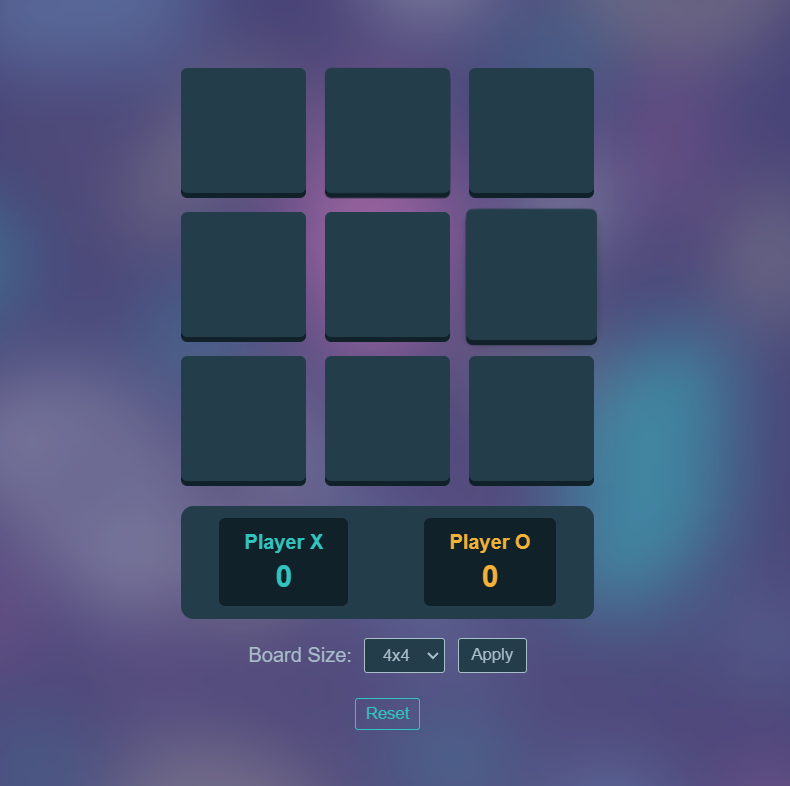

# 🎮 Tic Tac Toe Game ⭕❌

A responsive, browser-based implementation of the classic Tic Tac Toe game with customizable board sizes and score tracking.



## ✨ Features

- 🎯 Classic Tic Tac Toe gameplay
- 🔧 Customizable board sizes (3x3, 4x4, 5x5, and 6x6)
- 🏆 Score tracking for both players
- 📱 Responsive design
- ♿ Keyboard navigation support for accessibility
- 🔄 Reset game and scores functionality

## 🛠️ Technologies

- 📄 HTML5
- 🎨 CSS3
- ⚙️ JavaScript (ES6+)

## 🎲 How to Play

1. 🎮 The game starts with player X and alternates between X and O
2. 👆 Click on any empty cell to place your mark
3. 🏁 The first player to complete a row, column, or diagonal with their marks wins
4. 🤝 If all cells are filled without a winner, the game ends in a draw
5. 📊 Scores are tracked across multiple games
6. ⚙️ You can reset the game or change the board size using the controls

## 🔧 Customization

You can change the game's difficulty by selecting a different board size:
- 3️⃣ 3x3 (traditional)
- 4️⃣ 4x4 (more challenging)
- 5️⃣ 5x5 (advanced)
- 6️⃣ 6x6 (expert)

## 📦 Installation and Setup

1. 📥 Clone the repository:
   ```
   git clone https://github.com/n3ssar/tic-tac-toe.git
   ```

2. 📂 Open the project directory:
   ```
   cd tic-tac-toe
   ```

3. 🌐 Open `index.html` in your web browser.

## 💻 Development

### 📚 Project Structure

```
tic-tac-toe/
│
├── index.html       # Main HTML file
├── style.css        # CSS styles
├── script.js        # Game logic
└── tic-tac-toe.png  # Favicon image
```

### 🔍 Core Functions

- ✨ `createBoardArray()`: Initializes the game board data structure
- 🏆 `checkWin()`: Evaluates if a player has won through rows, columns, or diagonals
- 🤝 `checkDraw()`: Determines if the game has ended in a draw
- 🔄 `changeBoardSize()`: Allows modifying the game board dimensions
- 🔁 `resetBoard()`: Clears the game board for a new round
- 🧹 `resetScores()`: Resets the player score counters

## 🌐 Browser Compatibility

- 🦊 Firefox (latest)
- 🧭 Chrome (latest)
- 🧪 Safari (latest)
- 🌀 Edge (latest)


Project Link: https://tic-tac-tactic.netlify.app/

---

### 🌟 Star this repository if you find it useful! 🌟

#### 🎮 Enjoy playing Tic Tac Toe! 🎲
